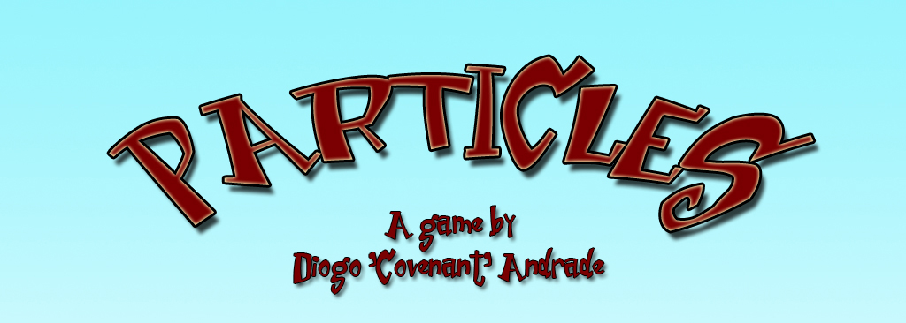
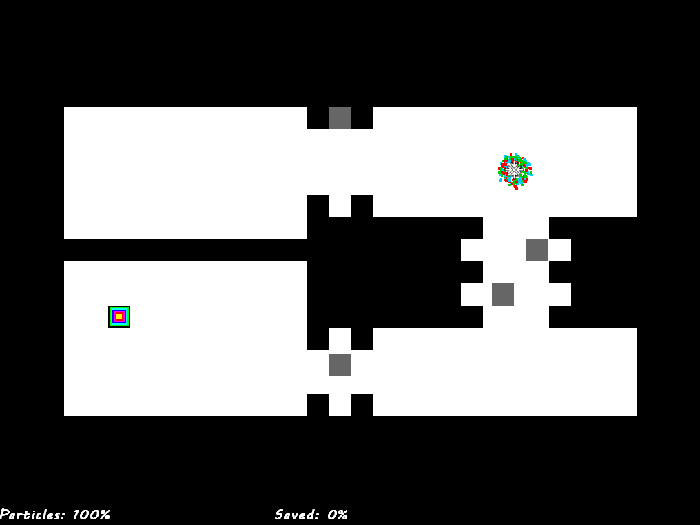
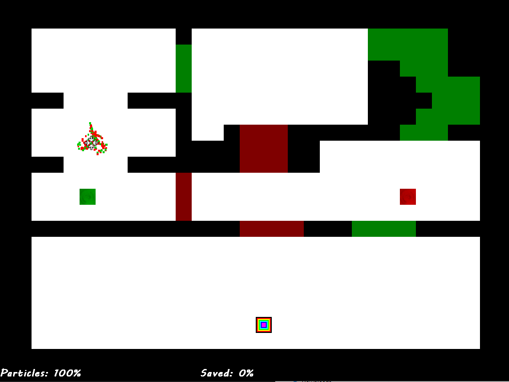
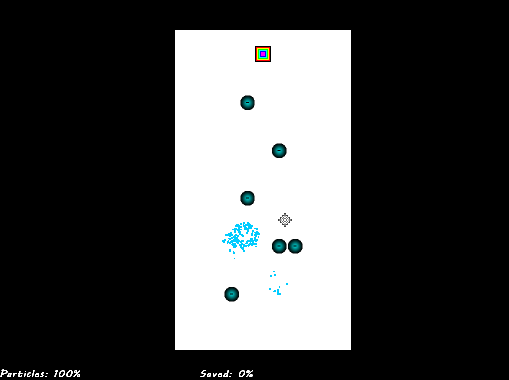

# PARTICLES

Developed for the very 26th Ludum Dare 48-hour compo, back in 2013, with theme "Minimalism ".
This one is actually my proudest achievement in game jams, the game was fun, I had time to do some level design and experiment around, and even added a colorblind mode (which is good in a color-dependent game)

The engine was done and released pre-compo, it's a very simple affair, game was all done during the 48 hours.

I've uploaded this for historical reasons, I doubt it is possible to make it compile again without a huge ammount of effort!

The game includes a tutorial as well to explain the game.

The objective is to lead some colored particles to the end area without losing any by hitting the walls, 
dealing with filters, magnets, etc
The game is fully mouse controlled.

## Licenses

- Code by Diogo de Andrade, licensed under the [MIT] license.
- All remaining art by Diogo de Andrade, available throught the [CC0] license.

## Metadata

- Autor: [Diogo Andrade]

[Diogo Andrade]:https://github.com/DiogoDeAndrade
[CC0]:https://creativecommons.org/publicdomain/zero/1.0/
[MIT]:LICENSE
